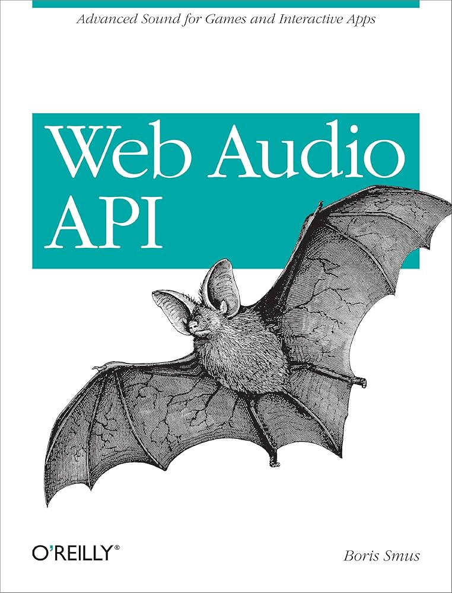

Welcome
=======
type: index
class: home

Welcome to the home of the book "Web Audio API: Advanced Sound for Games and Interactive Apps", a short book about the Web Audio API authored by [Boris Smus][boris] and published by [O'Reilly][orly].

# Samples

This site hosts interactive Web Audio [samples][] which are referenced in the book.

# Read for free

The author released the book for free under the [CC license][cc]. It's available to read online in a few formats:

- [HTML][html]
- [PDF][pdf]
- [MOBI][mobi]
- [EPUB][epub]

[cc]: https://creativecommons.org/licenses/by-nc-nd/4.0/deed.en
[orly]: http://shop.oreilly.com/product/0636920025948.do
[amzn]: http://www.amazon.com/Web-Audio-API-Boris-Smus/dp/1449332684
[html]: book/Web_Audio_API_Boris_Smus_html/toc.html
[epub]: book/Web_Audio_API_Boris_Smus.epub
[mobi]: book/Web_Audio_API_Boris_Smus.mobi
[pdf]: book/Web_Audio_API_Boris_Smus.pdf

# Translations

The community has kindly submitted translations of "Web Audio API" which are also freely available under the same [CC license][cc].

- [Japanese translation][jp] (huge thanks to Takasaki Takuya and Top Studio Inc)
- [Russian translation][ru] (huge thanks to Александр Григоренко)

[ru]: https://alexgriss.tech/web-audio-api-book/
[jp]: book/Web_Audio_API_Boris_Smus_japanese_translation_Takuya.epub

# Specifications

- [Web Audio API W3C specification](http://www.w3.org/TR/webaudio/)
- [Web MIDI API W3C specification](http://webaudio.github.io/web-midi-api/)
- [Media Capture and Streams specification](https://w3c.github.io/mediacapture-main/getusermedia.html)

# Found an error?

If you find an error on this page or in one of the samples, please [contact
Boris][boris] or better yet, [submit a github issue][gh].

&mdash; [Boris Smus][boris]

[gh]: https://github.com/borismus/webaudioapi.com
[boris]: http://smus.com/about/
[orly]: http://shop.oreilly.com/product/0636920025948.do
[amzn]: http://www.amazon.com/Web-Audio-API-Boris-Smus/dp/1449332684
[samples]: /samples/